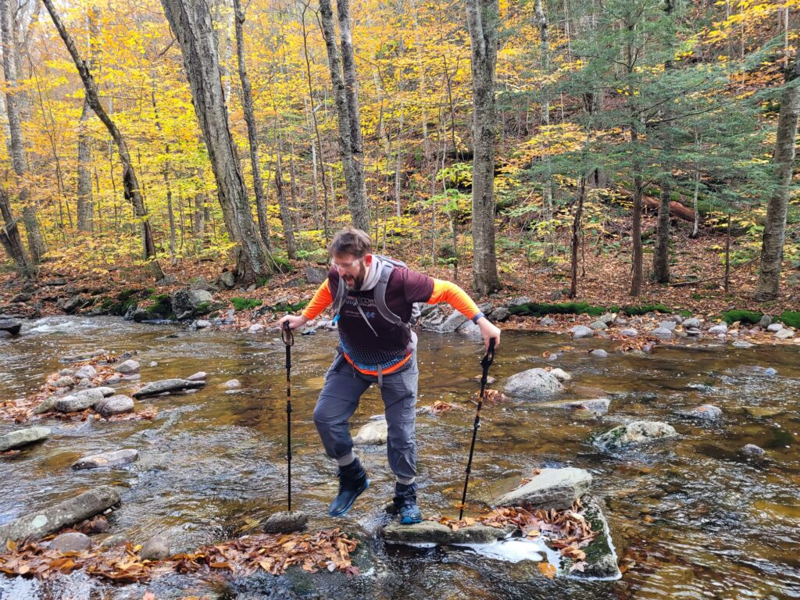

> "Try to be mindful, and let things take their natural course. Then your mind will become still in any surrounding, like a clear forest pool. All kinds of wonderful, rare animals will come to drink at the pool, and you will see clearly the nature of all things. You will see many strange and wonderful things come and go, but you will be still. Problems will arise, but you will see through them immediately. This is the happiness of the Buddha."
> 
> Ajahn Chah

I've had brief glimpses of this. "Self" as water feels like a good metaphor for the experience of being. "I" am not my thoughts or emotions; "I" am something else (awareness?), which can sometimes feel like a turbulent, cloudy pool, or a rushing river, and that's not the nature of water, but a function of its conditions at the moment.

Success! Crossing the Neversink River
