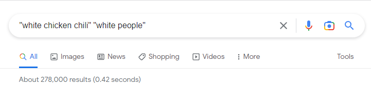

Adapted from a few recipes around the internet, with adjustments to make it taste like something. It's quite good!

_After looking up a bunch of recipes for white chicken chili, I tried to figure out why most of them seemed to employ_  
_only the merest dusting of seasoning... or ranch dressing... to no avail._

#### Ingredients

- 1/2 lb dried small white beans (Rancho Gordo's Alubia Blanca bean is very nice), soaked
    

- 2 T olive oil

- 2 lbs boneless, skinless chicken thighs

- 1 medium onion, small dice (save a little wedge for cooking the beans)

- 2 fresh jalapeños, minced (keeping the seeds will increase the heat, but you do you)

- 4 cloves garlic, minced (plus a clove for cooking the beans)

- 2 t oregano

- 2 t cumin

- 2 cans green chiles

- 5 c chicken broth (I use Better than Bouillon low-sodium chicken base + 5 c water)

- Kosher salt

- Freshly ground black pepper

- Crushed red pepper flakes (optional)

- 1 1/2 c frozen sweet corn

- 1 lime

- 1/2 c sour cream

- 1 bunch cilantro, chopped

- sharp Cheddar cheese, coarsely grated

- Tortilla chips

#### Preparation

##### _the beans_

Cover soaked beans with 3 inches of cold water in a saucepan. Add a small wedge of onion and a clove of garlic. Bring to a boil, reduce heat and simmer until beans are tender, which should take up to 1.5 hours or so. When beans are almost tender, add a good pinch of salt. Strain and set aside.

##### _the chili_

Pat chicken thighs dry with paper towel and salt on both sides. Heat oil in a large pot/Dutch oven over medium-high heat. Add chicken in batches to maintain a single layer without crowding, and brown on both sides (about 8 minutes per side). Remove to a cutting board and cut each thigh into 3 pieces.

Reduce heat to medium and add the chopped onion and jalapeño and cook until soft and translucent, about 5 minutes, scraping the bottom of the pot well. Add garlic, oregano, and cumin and cook 1 minute, being careful not to burn the garlic. Add canned green chiles and broth, return browned chicken pieces to pot, and season with salt and pepper. Bring to a boil, then reduce heat and simmer, with lid ajar, 15 minutes or until chicken is cooked through and somewhat tender.

Transfer chicken pieces to a cutting board and shred with two forks. Return to pot and add cooked beans. Bring to a simmer and cook 10 minutes, using a wooden spoon to mash some of the beans (to thicken the broth). Add frozen corn and return to simmer for a minute or two. Taste for salt, add freshly ground black pepper, and add crushed red pepper flakes if you'd like more heat. Add juice of 1 lime, stir well, and turn off heat. Stir in sour cream, then chopped cilantro.

Serve chili with Cheddar cheese, whole or crumbled tortilla chips, and hot sauce.
